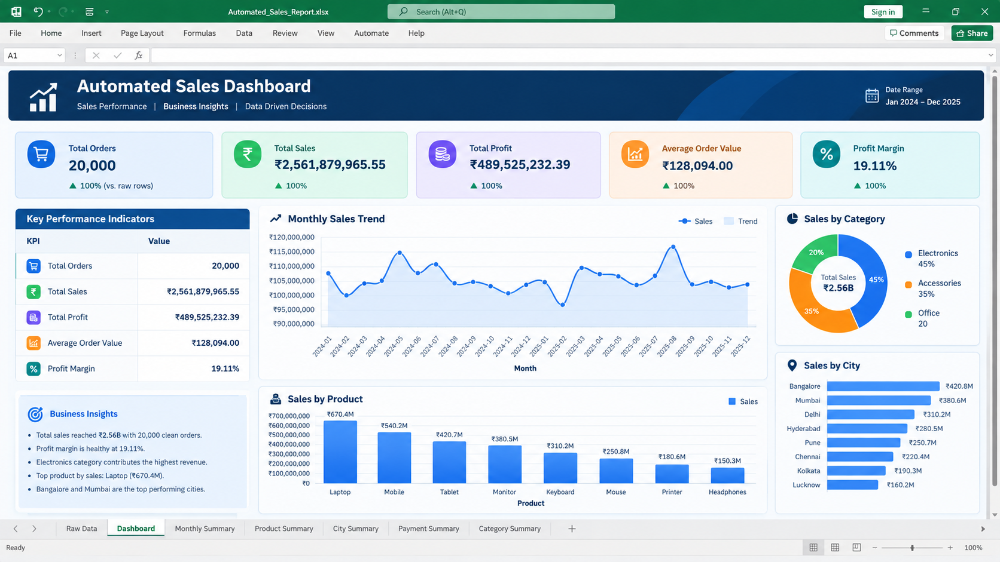

# Automated Excel Reporting with Python 📊⚙️

An end-to-end Python automation project that transforms raw sales data into a structured Excel business report with automated data cleaning, KPI calculations, summary tables, and a professional Excel dashboard.

## 📌 Project Overview

This project demonstrates how Python can automate repetitive Excel reporting workflows.

The pipeline takes raw sales data, cleans and validates it, calculates business KPIs, creates analytical summaries, and generates a professional Excel report with a centralized dashboard.

## 🔄 Workflow

Raw Sales Data → Data Cleaning → Data Validation → KPI Calculation → Business Summaries → Excel Report → Dashboard → Business Insights

## 📊 Dataset

- 20,015 raw records
- 20,000 unique orders
- 15 intentional duplicate records
- 16 columns
- 2 years of order data
- 8 products
- 8 cities
- 4 regions
- 5 payment methods
- Intentional missing values for data-cleaning practice

## 📈 Key Business KPIs

| KPI | Result |
|---|---:|
| Total Orders | 20,000 |
| Total Sales | ₹2,561,879,965.55 |
| Total Profit | ₹489,525,232.39 |
| Average Order Value | ₹128,094.00 |
| Profit Margin | 19.11% |

## 📊 Automated Excel Dashboard

The generated Excel dashboard contains:

- Total Orders
- Total Sales
- Total Profit
- Average Order Value
- Profit Margin
- Monthly Sales Trend
- Sales by Product

## 📑 Excel Report Sheets

The automated workbook contains:

- Dashboard
- Raw Data
- Monthly Summary
- Product Summary
- City Summary
- Payment Summary
- Category Summary

## 🧹 Data Cleaning & Transformation

The Python automation performs:

- Duplicate order removal
- Missing-value handling
- Date conversion
- Monthly feature creation
- Data validation
- Data aggregation
- KPI calculation
- Business summary generation

## 🛠️ Technologies Used

- Python
- Pandas
- NumPy
- OpenPyXL
- Matplotlib
- Seaborn
- Microsoft Excel

## 💡 Skills Demonstrated

### Python & Data Analysis

- Data cleaning
- Data transformation
- Pandas DataFrames
- GroupBy analysis
- KPI calculation
- Feature engineering

### Excel Automation

- Automated workbook creation
- Multiple worksheet generation
- Excel formatting
- Freeze panes
- Automatic column sizing
- Excel charts
- Dashboard creation

### Business Analytics

- Sales analysis
- Profit analysis
- Product performance
- City performance
- Category analysis
- Payment-method analysis
- Monthly sales trends

## 📂 Project Structure

automated-excel-reporting-python/
│
├── README.md
├── requirements.txt
├── generate_reporting_data.py
├── automated_excel_report.py
├── build_dashboard.py
├── sales_reporting_data_20000.csv
├── Automated_Sales_Report.xlsx
│
└── screenshots/
    └── automated_sales_dashboard.png

## ▶️ How to Run

### 1. Clone the Repository

git clone https://github.com/shivakant-data/automated-excel-reporting-python.git
cd automated-excel-reporting-python

### 2. Install Dependencies

pip install -r requirements.txt

### 3. Generate the Dataset

python generate_reporting_data.py

### 4. Generate the Excel Report

python automated_excel_report.py

### 5. Build the Dashboard

python build_dashboard.py

The final Excel report will be:

Automated_Sales_Report.xlsx

## 🔄 Analytical Workflow

Raw Data
↓
Duplicate Removal
↓
Missing Value Handling
↓
Date Processing
↓
Data Validation
↓
KPI Calculation
↓
Business Aggregation
↓
Excel Workbook
↓
Dashboard & Charts

## 🎯 Project Highlights

- 20,000+ business transactions
- Automated data-cleaning pipeline
- Automated KPI calculation
- Automated Excel report generation
- Automated summary tables
- Automated Excel charts
- Centralized Excel dashboard
- Reusable Python scripts
- Business-focused analytical workflow
- Portfolio-ready reporting solution

## ❓ Business Questions Answered

- What are the total sales and profit?
- What is the average order value?
- What is the overall profit margin?
- Which products generate the most sales?
- Which products generate the most profit?
- Which cities contribute the most revenue?
- How do sales change month by month?
- Which payment methods are most commonly used?
- Which product categories perform best?
- How can manual Excel reporting be automated?

## 🚀 Future Improvements

- Automated email delivery
- Scheduled daily/weekly reporting
- Advanced Excel conditional formatting
- Additional dashboard controls
- Power BI integration
- Automated PDF reports
- Database integration
- Cloud-based reporting

## 👤 Author

Shivakant

Data Analyst | Python | Pandas | Advanced SQL | Power BI | Excel | Data Visualization

GitHub: https://github.com/shivakant-data

## 📌 Project Purpose

This project demonstrates how Python can automate repetitive Excel reporting workflows used in business and data analyst environments.

It covers the complete workflow:

Raw Data → Cleaning → Analysis → KPI Calculation → Excel Automation → Dashboard → Business Reporting
